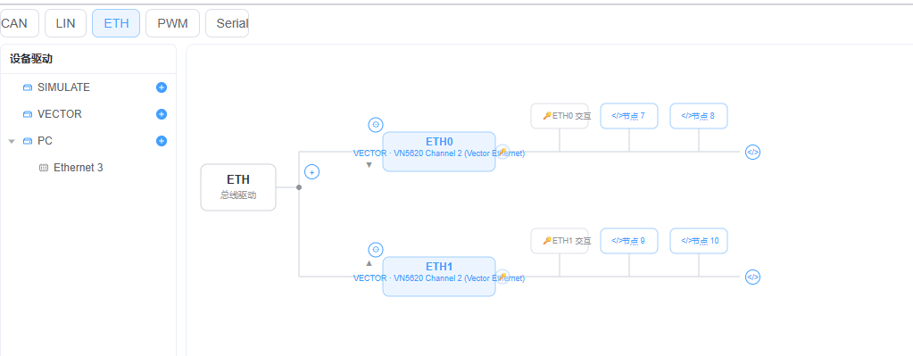

**墨子.婴听**

# 背景

1.本项目base 基于开源项目Ecu Bus Pro 改造的，因博主用不惯Ecu bus pro 的逻辑，自己用AI改成了个人习惯的界面，又使用rust+tauri 替换了electron 架构，简化了软件的安装大小与内存消耗。
2. 本项目的名称来自古代墨子的发明,婴听,用陶翁通过地面来监听远处的信号声音,与我们用于监听总线声音有类似的作用,所以以此为名称.

# 我们的优化点

完全继承了EcuBus-Pro的插件生态

## 多语言

默认可选中英文

## 简易的操作界面

比CANoe还简单的操作界面

通道与配置一目了然

直观的设备树配置

## RUST+Tauri

更安全的性能,与更小的软件体积

## 开源自定义
