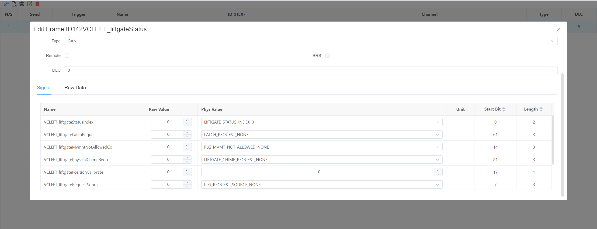
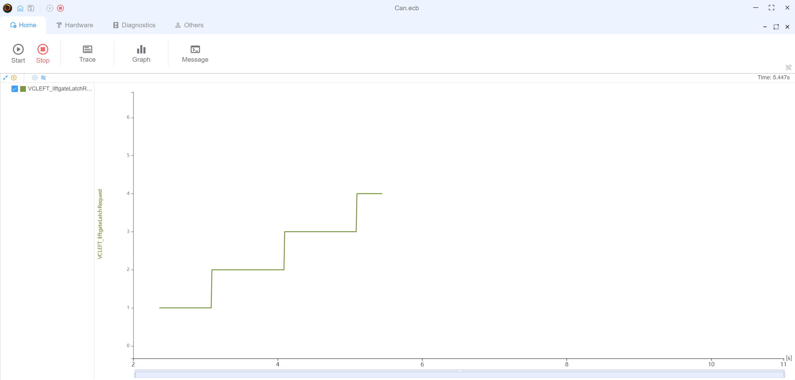

# CAN 示例

本示例演示了在 yingting 中基本 CAN 通信的设置和使用。

## 网络结构

该示例包含三个节点：

- 节点 1（棕色）- 信号生成器节点
- Can IA（天蓝色）- 交互式分析界面
- SIMULATE_0（蓝色）- CAN 总线模拟器

节点以 CAN 网络拓扑结构连接，节点 1 通过 SIMULATE_0 设备发送信号，这些信号可以在 Can IA 中监控和分析。

## 演示功能

1. **报文传输**

   - 节点 1 运行一个定期更新信号值的脚本
   - 信号：VCLEFT_liftgateLatchRequest（在值 0-4 之间循环）
   - 更新间隔：1000 毫秒

   ```typescript
   // Node 1 script
   import { setSignal } from 'ECB'
   let val = 0
   setInterval(() => {
     setSignal('Model3CAN.VCLEFT_liftgateLatchRequest', val++ % 5)
   }, 1000)
   ```

2. **数据可视化**

   - 在 Can IA 中进行实时信号绘图
   - 报文跟踪记录
   - 网络拓扑视图

3. **交互控制**

   - 启动/停止帧发送
   - 信号值检查
     

4. **图表**

   - 绘制信号 `VCLEFT_liftgateLatchRequest` 的图表

   

## 使用方法

1. 加载示例配置文件 (`Can.ecb`)
2. 网络拓扑将显示在网络视图中
3. 启动模拟以查看节点 1 生成信号值
4. 使用 Can IA 界面来：
   - 监控信号变化
   - 查看报文跟踪
   - 观察实时信号图表
   - 检查报文详情

本示例演示了如何在 yingting 中设置自动化信号生成和监控，非常适合学习基本 CAN 通信概念和信号分析功能。
