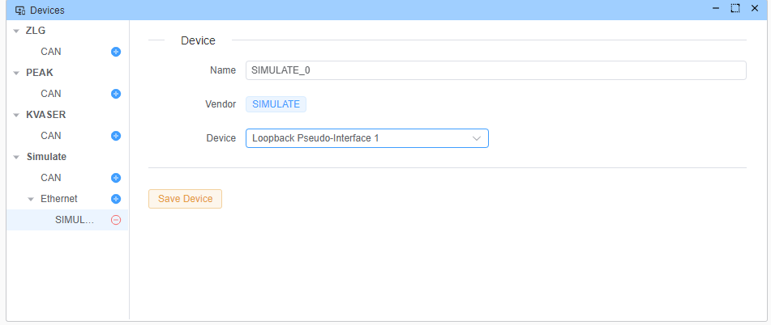
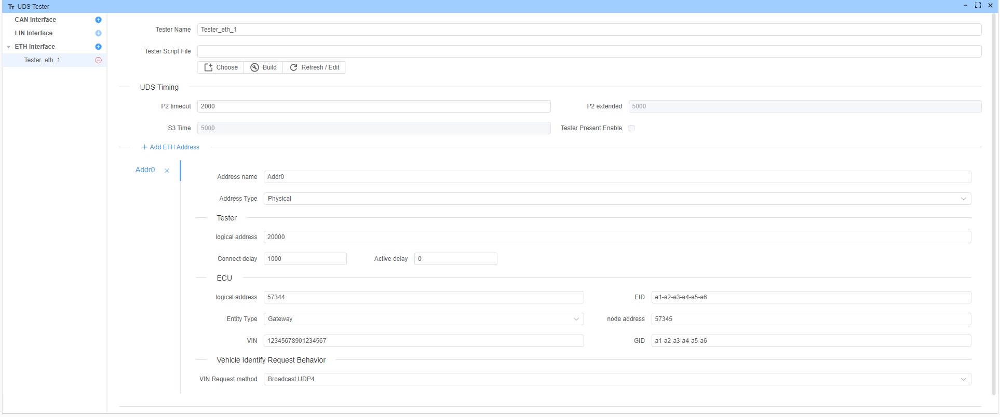
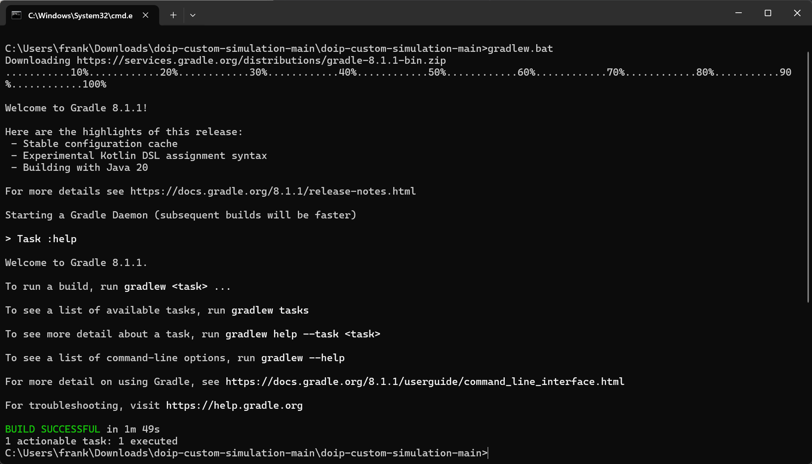
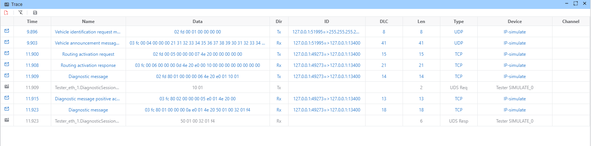

# DoIP 示例

本示例演示如何使用 DOIP 协议与 ECU 通信。 `yingting` 充当测试器，而 `doip-custom-simulation` 充当实体（网关）。

## yingting 设置

### 设备

使用环回通道


### 测试器

地址信息从 `doip-custom-simulation` 的 gateway.properties 文件获取

- 测试器地址：20000
- 网关地址：57344
- ECU 地址：57345



## `doip-custom-simulation` 设置

`doip-custom-simulation` 是 DOIP 协议的定制仿真，充当实体。 有关更详细信息，请访问 [doip-custom-simulation GitHub 仓库](https://github.com/doip/doip-custom-simulation)。

### 安装

```bash
git clone https://github.com/doip/doip-custom-simulation.git
```

### 构建

```bash
cd doip-custom-simulation

.\gradlew.bat build
```

> [!TIP]
> 如果下载 gradle 太慢，请使用阿里云镜像，
> 编辑 gradle/wrapper/gradle-wrapper.properties 文件
> 将 `distributionUrl` 更新为 `https\://mirrors.aliyun.com/macports/distfiles/gradle//gradle-8.1.1-bin.zip`



### 生成 dist

```bash
.\gradlew.bat installDist
```

### 运行

\*.properties 文件是配置文件，您可以修改它以更改配置。

```bash
cd build\install\doip-custom-simulation

java "-Dlog4j.configurationFile=log4j2.xml" -jar libs/doip-custom-simulation-2.0.0.jar gateway.properties
```

来自 doip-custom-simulation 的日志：

```bash
10:55:24.574 [GW:TCP-RECV-1]  TRACE  doip.simulation.standard.StandardGateway         - >>> public void onConnectionClosed(DoipTcpConnection doipTcpConnection)
10:55:24.574 [GW:TCP-RECV-1]  TRACE  doip.library.comm.DoipTcpConnection              - >>> void removeListener(DoipTcpConnectionListener listener)
10:55:24.574 [GW:TCP-RECV-1]  TRACE  doip.library.comm.DoipTcpConnection              - <<< void removeListener(DoipTcpConnectionListener listener)
10:55:24.574 [GW:TCP-RECV-1]  TRACE  doip.simulation.standard.StandardGateway         - <<< public void onConnectionClosed(DoipTcpConnection doipTcpConnection)
10:55:24.575 [GW:TCP-RECV-1]  TRACE  doip.library.comm.DoipTcpConnection              - <<< public void onSocketClosed()
10:55:24.575 [GW:TCP-RECV-1]  TRACE  doip.library.net.TcpReceiver                     - <<< public void onSocketClosed()
10:55:24.575 [GW:TCP-RECV-1]  TRACE  doip.library.net.TcpReceiverThread               - <<< void run()
10:59:23.777 [Thread-3    ]  INFO   doip.simulation.standard.StandardTcpConnectionGateway - Connection will be closed due to general inactivity timer expired. General inactivity time was 300000 ms.
10:59:23.778 [Thread-3    ]  TRACE  doip.library.comm.DoipTcpConnection              - >>> public void stop()
10:59:23.779 [Thread-3    ]  TRACE  doip.library.net.TcpReceiverThread               - >>> void stop()
10:59:23.779 [Thread-3    ]  DEBUG  doip.library.net.TcpReceiverThread               - Close socket
10:59:23.779 [Thread-3    ]  TRACE  doip.library.net.TcpReceiverThread               - <<< void stop()
10:59:23.791 [Thread-3    ]  TRACE  doip.library.net.TcpReceiver                     - >>> void removeListener(TcpReceiverListener listener)
10:59:23.792 [Thread-3    ]  TRACE  doip.library.net.TcpReceiver                     - <<< void removeListener(TcpReceiverListener listener)
10:59:23.792 [Thread-3    ]  TRACE  doip.library.comm.DoipTcpConnection              - <<< public void stop()
```

## 执行

启动序列并打开跟踪窗口以查看所有帧。 或者，使用 Wireshark 捕获这些帧。

