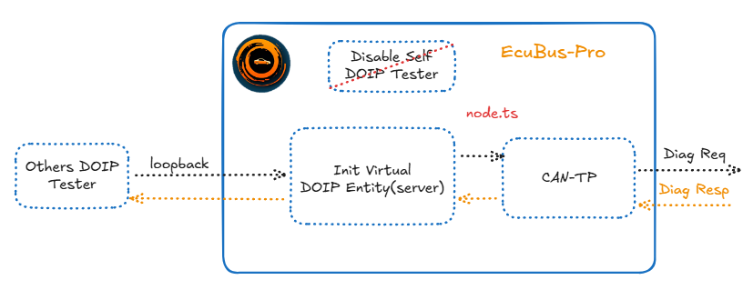
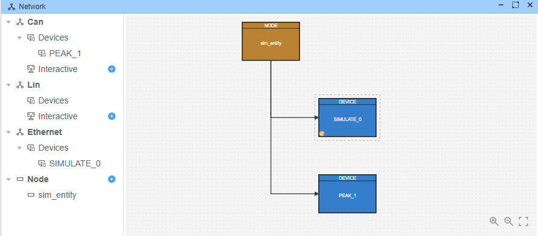

# DoIP网关

本示例演示如何实现一个DoIP到CAN网关，用于桥接DoIP测试仪与基于CAN的ECU之间的通信。 该网关接收DoIP诊断请求并将其转发到CAN总线，然后通过DoIP返回CAN响应。

## 架构概述

本示例模拟了一个DoIP网关，该网关：

1. 注册为DoIP虚拟实体 - 有关虚拟实体注册的详细信息，请参阅[示例](./../doip_sim_entity/readme.md)
2. 从以太网测试仪接收DoIP诊断请求
3. 通过CANTP将请求转发到CAN总线
4. 将CAN响应返回给DoIP测试仪



## 设置

### 设备配置

配置网络拓扑，包括：

- **Eth**：用于DoIP通信的以太网连接
- **Can**：用于ECU通信的CAN总线连接
- **设备**：
  - `SIMULATE_0`：模拟DoIP接口
  - `PEAK_1`：用于ECU通信的CAN接口

### 节点配置

添加一个节点项并附加网关脚本（`node.ts`）



网关脚本实现以下功能：

```typescript
import { DiagResponse, output, RegisterEthVirtualEntity } from 'ECB'

Util.Init(async () => {
  console.log('Registering virtual entity')
  await RegisterEthVirtualEntity(
    {
      vin: '123456789',
      eid: '00-00-00-00-00-00',
      gid: '00-00-00-00-00-00',
      logicalAddr: 100
    },
    '127.0.0.1'
  )
})

Util.On("Tester_eth_1.*.send", async (req) => {
  console.log('Received DOIP Diag request')
  req.testerName='Tester_can_0'
  await req.outputDiag('PEAK_1')
})
Util.On("Tester_can_0.*.recv", async (resp) => {
  console.log('Received CANTP Diag response')
  resp.testerName='Tester_eth_1'
  await resp.outputDiag('SIMULATE_0')
})
```

**关键特性：**

- **DoIP实体注册**：注册一个逻辑地址为100的虚拟实体
- **请求转发**：将DoIP请求转换为CAN诊断请求
- **响应桥接**：将CAN响应转发回DoIP测试仪

## 使用Python客户端作为其他测试仪

提供了一个Python测试客户端（`client.py`）用于外部测试：

```python
import udsoncan
from doipclient import DoIPClient
from doipclient.connectors import DoIPClientUDSConnector
from udsoncan.client import Client
from udsoncan.services import *

udsoncan.setup_logging()

ecu_ip = '127.0.0.1'
ecu_logical_address = 100
doip_client = DoIPClient(ecu_ip, ecu_logical_address, client_logical_address=200)
conn = DoIPClientUDSConnector(doip_client)

with Client(conn, request_timeout=2) as client:
    try:
        client.change_session(DiagnosticSessionControl.Session.extendedDiagnosticSession)
    except NegativeResponseException as e:
        print('Server refused request:', e.response.code_name)
    except (InvalidResponseException, UnexpectedResponseException) as e:
        print('Invalid server response:', e.response.original_payload)

doip_client.close()
```

**Python客户端的前提条件：**

```bash
pip install udsoncan doipclient
```

## 执行

1. **启动模拟**：在yingting中启动运行
2. **监控流量**：使用内置跟踪窗口查看所有帧
3. **替代监控**：使用Wireshark捕获网络流量
4. **使用Python测试**：运行`python client.py`发送测试请求
