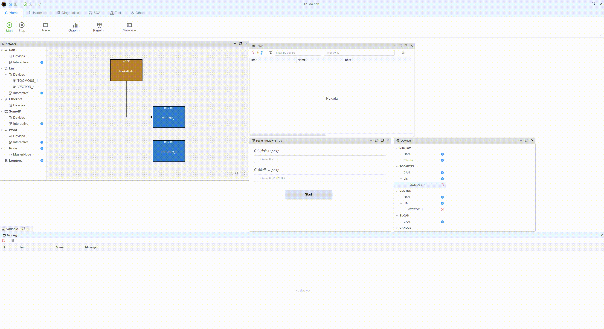
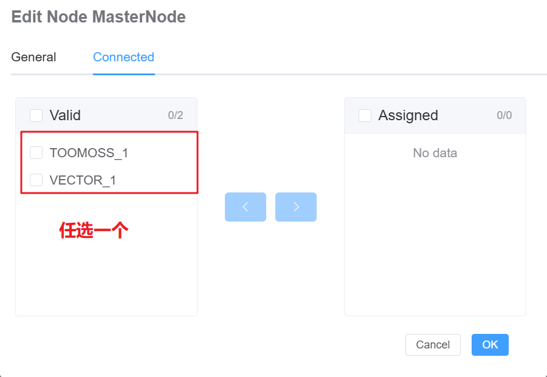

# LIN 自动寻址（AA）示例

## 概述

LIN 自动寻址用于分配/更改 NAD、读取标识并切换到正常数据通信。

## 已验证设备

Toomoss & Vector

## 图形

## 特性

- LIN 设备自动寻址

## 文件

- `lin_aa.ecb`：项目配置
- `lin_aa.ts`：TypeScript 实现脚本
- `README.md` / `README.zh.md`：文档

## 用法

1. 在 yingting 中打开 `lin_aa.ecb`
2. 配置 LIN 硬件
   1. 
3. 开始前设置变量：
   - `LIN_AA.SupplierID`（十六进制字符串），例如 `7FFF` 或 `0x7FFF`
   - `LIN_AA.NadTable`（空格分隔的十六进制字节），例如 `01 02 03 04 11 aa`
4. 设置 `LIN_AA.StartAA = 1` 开始，`0` 停止
5. 在控制台中按 `c` 以十六进制打印当前 `SupplierID` 和 `NadTable`

## 自动寻址序列

1. 分配 NAD（初始化）
2. 多重设置 NAD（遵循 `NadTable` 顺序）
3. 保存
4. 完成

## 参考资料

- LIN 2.2 规范
- yingting 用户手册
