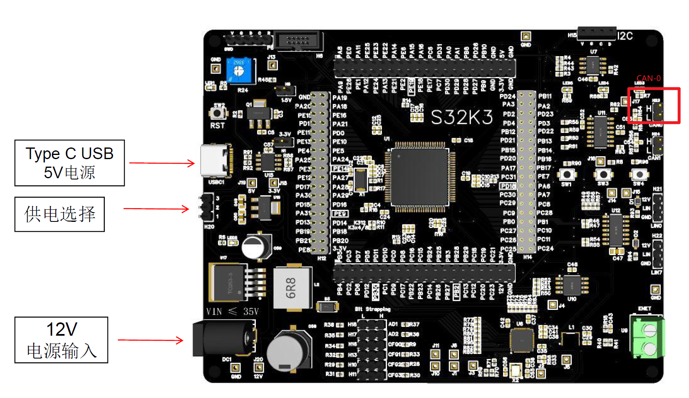
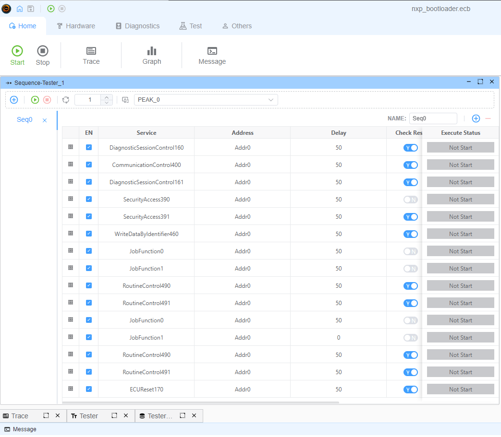

# NXP Bootloader 示例

- 接口：`CAN`
- 供应商设备：[KVASER Leaf V3](https://kvaser.com/product/leaf-v3/)
- 测试板：[S32K344/324/314大开发板EVB评估板](https://item.taobao.com/item.htm?abbucket=19&id=740622398903&ns=1&pisk=foBIpV2TH20CwzFUG0Ew5MELoK95FawqR0tRmgHE2pppy1scPerutp56PNQ6Jvr3tQL5-pdlTU8ePLslllz43-ShxLvTury2-9WlzK0KvX3yXVKWtPrZ7-ShxUmIyo5T34GtHzkKwUQJBCKDALnpvBE6BnxXevd-pf39SFLJeUL-6VK2qYhpya39X3x223LK9ce9q3vJyap-wku64WtRAlu6g--gKeSp5xsGCHLstMTseY611BTA3FM-eOtdjWT25xNyksYegEbTQv95X3_6g6ajdasRm_d1F2EFkgQhCpvbakAf6152O1aKFFWeVIpJ10HRfdTGlTpYHVtG6M5RKwiSeHXF3QTD1uHkadB2MsQIqoj9p3QkiTzmKeIRmtf2hJgDA1IXCg-o3ENK9bi6iYt6ulZsZbX7XcDfljopZBKMv-r_fVGk9hxtlTrsOXRpjhP8flgLf&priceTId=213e363a17316432955378124eef04&skuId=5466402150063&spm=a21n57.1.item.3.3173523c0cLCx7&utparam=%7B%22aplus_abtest%22%3A%22b157c0e4b60c27af3bd36a542bb06f7a%22%7D&xxc=taobaoSearch)，或 NXP S32K344EVB。
  
- ECU 代码：[NXP Bootloader](https://community.nxp.com/t5/S32K-Knowledge-Base/Unified-bootloader-Demo/ta-p/1423099)

## 描述

本示例演示如何使用 yingting 通过 UDS CAN 协议升级应用固件。 本示例使用 `KVASER Leaf V3` 作为 USB-CAN 适配器。

## CAN 配置

- CAN
- 波特率：500Kbps
- TX ID：0x784
- RX ID：0x7f0

## 连接

| KVASER Leaf V3 | S32K344大开发板EVB评估板 |
| -------------- | ----------------- |
| CANH           | CAN0 H23-1        |
| CANL           | CAN0 H23-2        |

## 使用方法

1. 下载 [NXP Bootloader](https://community.nxp.com/t5/S32K-Knowledge-Base/Unified-bootloader-Demo/ta-p/1423099)。
   1. 下载的演示基于旧的 yingting 工具，该工具已弃用。 新的 yingting 工具具有更多功能和更好的性能。
2. 如果您使用 `NXP S32K344EVB`，可以直接下载固件。 如果您使用 `S32K344大开发板EVB评估板`，需要修改 LPUART 引脚和 LED 引脚。
3. 将 USB-CAN 适配器连接到计算机，并将 `KVASER Leaf V3` USB-CAN 适配器连接到 S32K344 板。
4. 运行 Sequence-Tester_1。

---

## 诊断步骤



本示例通过 UDS 诊断协议实现固件升级。 主要步骤如下：

1. 会话控制和通信控制

   - DiagnosticSessionControl (0x10) 切换到编程会话 (0x03)
   - CommunicationControl (0x28) 禁用正常通信 (controlType=0x03)
   - DiagnosticSessionControl (0x10) 切换到扩展会话 (0x02)

2. 安全访问

   - SecurityAccess (0x27, subfunction=0x01) 请求种子
   - SecurityAccess (0x27, subfunction=0x02) 发送密钥
   - 密钥计算使用 AES-128-CBC 算法，密钥为 [0-15]，IV 全为零

3. 写入标识符

   - WriteDataByIdentifier (0x2E, DID=0xF15A) 写入特定标识符

4. 下载程序
   对于每个固件文件：

   1. RequestDownload (0x34) 请求下载，指定内存地址和大小
   2. RoutineControl (0x31, routineId=0x0202) 验证 CRC
   3. TransferData (0x36) 以块方式传输数据
   4. RequestTransferExit (0x37) 结束传输

5. 固件验证和复位
   - RoutineControl (0x31, routineId=0xFF00) 验证固件
   - RoutineControl (0x31, routineId=0xFF01) 验证完成
   - ECUReset (0x11) 复位 ECU

## 固件文件

示例包含两个固件文件：

1. S32K344_FlsDrvRTD100.bin

   - 下载地址：0x20000010
   - 驱动固件

2. S32K344_CAN_App_RTD200.bin
   - 下载地址：0x00440200
   - 应用固件

## 注意事项

1. 确保固件文件放置在项目的 bin 目录中
2. 下载过程中请勿断开连接或断电
3. 如果下载失败，可以重试整个流程
4. 每个固件文件都需要 CRC 验证

---

**[演示视频](https://www.bilibili.com/video/BV1KcmfYNEkQ)**

## 脚本实现细节

bootloader.ts 脚本实现了诊断序列。 以下是每个部分的详细说明：

### 初始化和导入

```typescript
import crypto from 'crypto'
import { CRC, DiagRequest, DiagResponse } from 'ECB'
import path from 'path'
import fs from 'fs/promises'
```

- 导入加密、CRC计算和文件操作所需的模块
- `ECB` 提供 UDS 诊断通信实用程序

### 配置

```typescript
const crc = new CRC('self', 16, 0x3d65, 0, 0xffff, true, true)
let maxChunkSize: number | undefined = undefined
let content: undefined | Buffer = undefined
```

- 配置用于固件验证的 CRC-16 计算器
- 用于存储传输块大小和固件内容的变量

### 固件文件配置

```typescript
const fileList = [
  {
    addr: 0x20000010,
    file: path.join(process.env.PROJECT_ROOT, 'bin', 'S32K344_FlsDrvRTD100.bin')
  },
  {
    addr: 0x00440200,
    file: path.join(process.env.PROJECT_ROOT, 'bin', 'S32K344_CAN_App_RTD200.bin')
  }
]
```

- 定义要下载的固件文件及其目标地址

### 初始化处理程序

```typescript
Util.Init(async () => {
  const req = DiagRequest.from('Tester_1.RoutineControl491')
  req.diagSetParameter('routineControlType', 1)
  await req.changeService()
  const resp = DiagResponse.from('Tester_1.RoutineControl491')
  resp.diagSetParameter('routineControlType', 1)
  await resp.changeService()
})
```

- 修改 RoutineControl491 服务以使用类型 1（启动例程）
- 更新请求和响应参数

### 安全访问处理程序

```typescript
Util.On('Tester_1.SecurityAccess390.recv', async (v) => {
  const data = v.diagGetParameterRaw('securitySeed')
  const cipher = crypto.createCipheriv(
    'aes-128-cbc',
    Buffer.from([0, 1, 2, 3, 4, 5, 6, 7, 8, 9, 10, 11, 12, 13, 14, 15]),
    Buffer.alloc(16, 0)
  )
  let encrypted = cipher.update(data)
  cipher.final()
  const req = DiagRequest.from('Tester_1.SecurityAccess391')
  req.diagSetParameterSize('data', 128)
  req.diagSetParameterRaw('data', encrypted)
  await req.changeService()
})
```

- 处理安全访问种子-密钥交换
- 使用 AES-128-CBC 根据接收到的种子计算密钥
- 将计算出的密钥发送回 ECU

### 下载过程处理程序

```typescript
Util.Register('Tester_1.JobFunction0', async () => {
  // Prepare next firmware file for download
  const item = fileList.shift()
  if (item) {
    // Request download and verify CRC
    // Returns array of requests to be sent
  }
  return []
})

Util.Register('Tester_1.JobFunction1', () => {
  // Handle actual data transfer
  // Splits firmware into chunks and sends them
  // Ends with transfer exit request
  // Returns array of requests to be sent
})
```

- JobFunction0：通过以下方式准备下载：
  1. 获取下一个固件文件
  2. 设置具有正确地址的下载请求
  3. 计算并验证 CRC
- JobFunction1：通过以下方式处理数据传输：
  1. 将固件分割为适当大小的块
  2. 为每个块创建 TransferData 请求
  3. 在末尾添加 RequestTransferExit
  4. 在最后一个文件后触发固件验证

该脚本与 ECB 文件中定义的序列协同工作，该序列执行：

1. 会话和通信控制服务
2. 安全访问序列
3. JobFunction0 准备下载
4. JobFunction1 传输数据
5. 最终验证和重置
