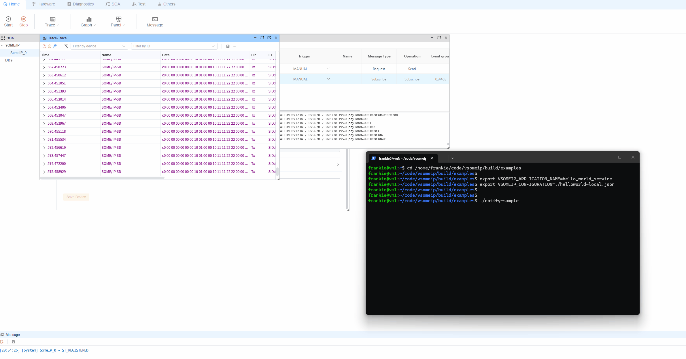

# SOME/IP Remote Example (vsomeip `notify-sample`)

The `remote` side in this folder is based on the official `vsomeip` example app: `notify-sample`.
You can treat it as the remote SOME/IP service, while `ecubus-pro` acts as the client that discovers the service and receives notifications.

## 1. Prerequisites

- `vsomeip` is installed and working (including sample binaries)
- `notify-sample` can be executed on the remote host
- Network connectivity is available between remote and local host
- `someip_remote.json` in this folder is prepared (adjust path as needed)

## 2. Network Preparation (Linux)

If multicast routing is not available by default in your environment, run:

```bash
sudo ip route add multicast 224.0.0.0/4 dev eth0
```

Replace `eth0` with your actual network interface (for example `enp3s0`, `ens33`, etc.).

## 3. Set vsomeip Environment Variables

Set these variables in the same terminal where you will start `notify-sample`:

```bash
export VSOMEIP_CONFIGURATION=/path/to/someip_remote.json
export VSOMEIP_APPLICATION_NAME=hello_world_service
```

Notes:

- `VSOMEIP_CONFIGURATION`: path to the remote-side vsomeip config file
- `VSOMEIP_APPLICATION_NAME`: must match the application name defined in the config

## 4. Start Remote (`notify-sample`)

```bash
notify-sample
```

If startup succeeds, you should see logs related to service registration, service discovery, and event notifications.

## 5. Use with yingting

1. Open the `someip_remote` example in yingting (or import equivalent configuration)
2. Ensure local/remote IP, port, Service ID, Instance ID, and Event Group values match
3. In `SomeIP IA`, run the `subscribe` action first (`someipOp=subscribe`, `methodId=0x8778`)
4. After subscription succeeds, run or observe the notify flow (the second SOME/IP IA action) and verify notifications from `notify-sample`

Important:

- This project contains **two** SOME/IP IA actions.
- You must execute the **subscribe** action first; otherwise, notify messages will not be received.



## 6. Troubleshooting

- Service is not discovered:
  - Verify network connectivity (`ping`)
  - Check firewall rules for SOME/IP UDP multicast/unicast traffic
  - Confirm `someip_remote.json` matches yingting settings
- Service is discovered but no events:
  - Verify the `subscribe` action was executed successfully before checking notifications
  - Verify `notify-sample` is still running and publishing notifications
- Multi-NIC environment issues:
  - Bind the correct NIC/IP in configuration
  - Temporarily keep only the target NIC enabled to remove route ambiguity

## 7. Minimal Startup Commands

```bash
sudo ip route add multicast 224.0.0.0/4 dev eth0
export VSOMEIP_CONFIGURATION=/path/to/someip_remote.json
export VSOMEIP_APPLICATION_NAME=hello_world_service
notify-sample
```