# UDS Authentication Service(0x29) Example

The 0x29 Authentication Service was introduced in ISO 14229-1:2020 as a modern replacement for the traditional Security Access (0x27) service. This guide demonstrates how to implement and test the 0x29 service using yingting, providing a more secure and certificate-based authentication mechanism for ECU access.

> Note: ISO 15765-4 has deprecated the 0x27 service, making 0x29 the recommended approach for modern automotive security implementations.

## Authentication Modes

The 0x29 service supports two authentication modes:

1. **APCE (Asymmetric Proof of Possession and Certificate Exchange)** - Primary mode
2. **ACR (Asymmetric Challenge Response)** - Rarely used

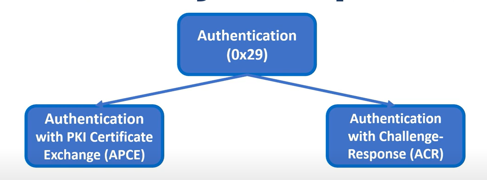

### APCE (Certificate Exchange Verification) Overview

Traditional security approaches using 0x27 had significant vulnerabilities - once a key or algorithm was compromised, any entity could access the ECU at any time. The 0x29 APCE mode addresses these issues by requiring:

1. **Unique Certificates**: Unlike shared keys, each supplier has unique certificates containing identifying information, enabling accountability if compromised
2. **Certificate Authority Control**: Suppliers must request certificates from OEMs, removing self-signing capabilities
3. **Time-Limited Access**: Certificates have expiration dates, unlike permanent keys

### ACR (Challenge Response) Overview

This mode is similar to 0x27 but uses asymmetric cryptography and server-generated challenges to prevent replay attacks. However, it's not widely recommended by AUTOSAR DCM.

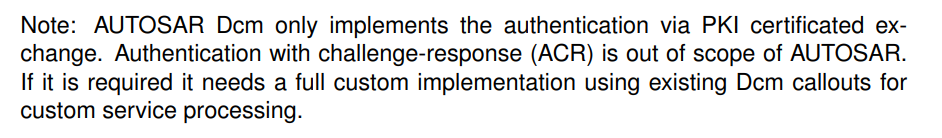

## APCE Implementation Details

The APCE authentication process uses several key sub-functions:

- `deAuthenticate` (0x00)
- `verifyCertificateUnidirectional` (0x01)  
- `verifyCertificateBidirectional` (0x02)
- `proofOfOwnership` (0x03)
- `authenticationConfiguration` (0x08)

### deAuthenticate (Sub-function: 0x00)

Terminates the authentication session and resets server state.

**Request Format:**
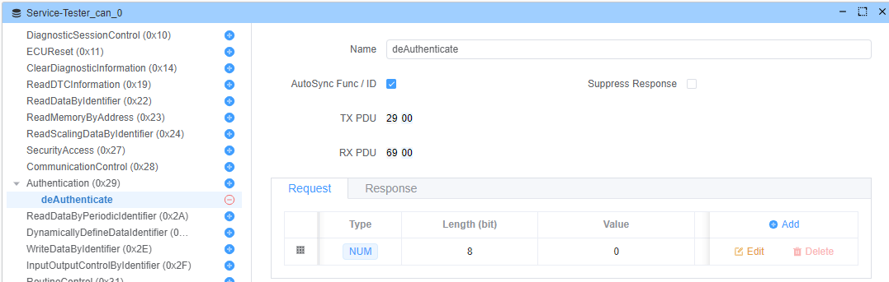

**Response Format:**
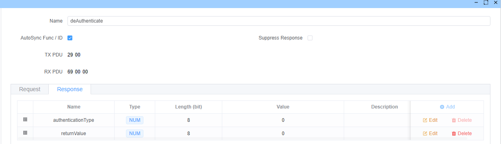

### verifyCertificateUnidirectional (Sub-function: 0x01)

Initiates unidirectional certificate verification where the server validates the client.

**Request Parameters:**

1. `communicationConfiguration` (1 byte) - Must be 0x00
2. `lengthOfCertificateClient` (2 bytes) - Certificate length  
3. `certificateClient` (variable) - Client certificate data
4. `lengthOfChallengeClient` (2 bytes) - Challenge length
5. `challengeClient` (variable) - Cryptographically secure random challenge

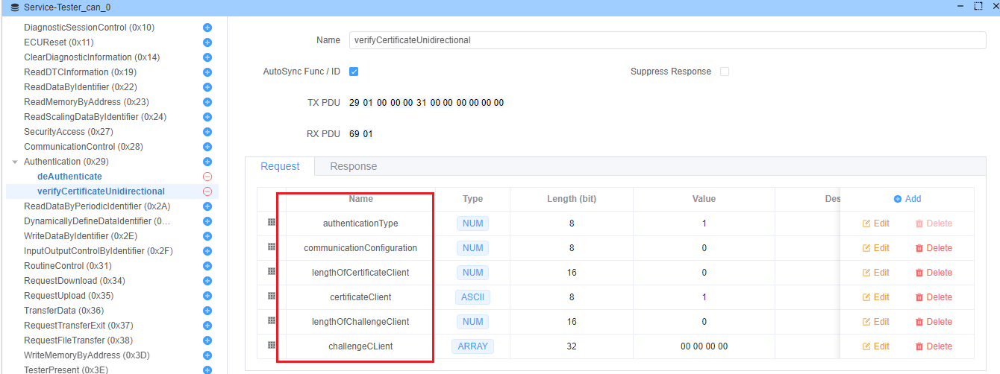

**Response Parameters:**

1. `returnValue` (1 byte) - Operation result code
2. `lengthOfChallengeServer` (2 bytes) - Server challenge length
3. `challengeServer` (variable) - Server-generated challenge
4. `lengthOfEphemeralPublicKeyServer` (2 bytes) - Server public key length
5. `ephemeralPublicKeyServer` (variable) - Server's ephemeral ECDH/DH public key

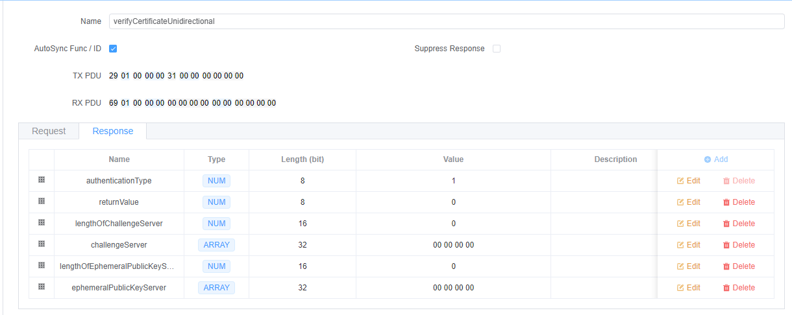

### proofOfOwnership (Sub-function: 0x03)

Proves that the client possesses the private key corresponding to the certificate.

**Request Parameters:**

1. `lengthOfProofOfOwnershipClient` (2 bytes)
2. `proofOfOwnershipClient` (variable) - Digital signature of server challenge
3. `lengthOfEphemeralPublicKeyClient` (2 bytes)  
4. `ephemeralPublicKeyClient` (variable) - Client's ephemeral public key

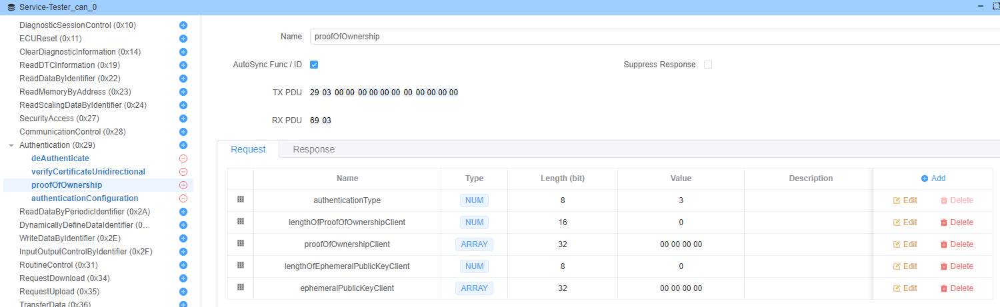

**Verification Process:**
The server verifies the client's digital signature using the certificate's public key:

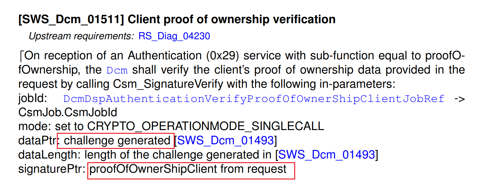

**Response Parameters:**

1. `returnValue` (1 byte) - Verification result
2. `lengthOfSessionKeyInfo` (2 bytes) - Session key information length
3. `sessionKeyInfo` (variable) - Derived session key data

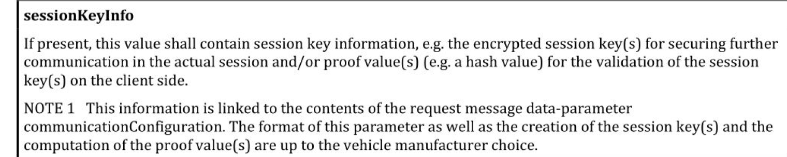

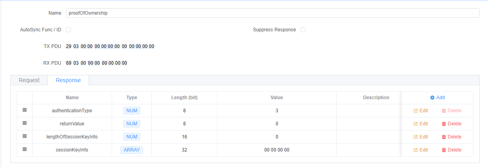

> Note: AUTOSAR DCM currently does not support session keys:
> 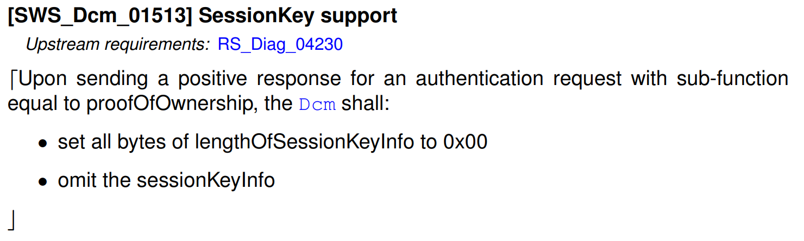

### authenticationConfiguration (Sub-function: 0x08)

Initiates APCE mode configuration.

**Request:**
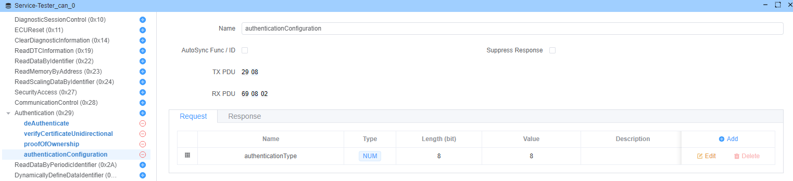

**Response:**
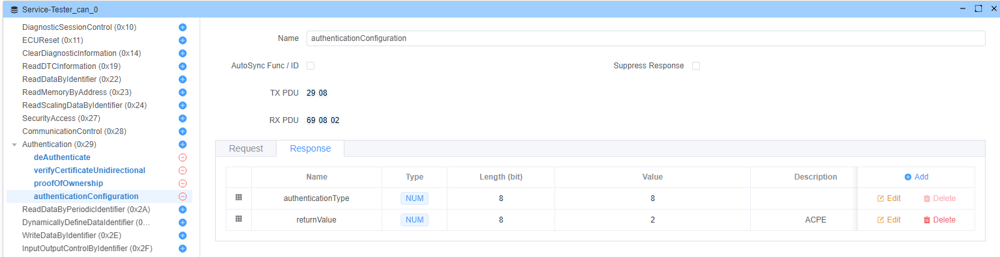

## Certificate Preparation

Generate the necessary certificates using OpenSSL:

### 1. Generate Root CA Private Key

```bash
openssl genrsa -out ca.key 4096
```

### 2. Create Root CA Certificate

Create a configuration file `req.cnf`:

```ini
[ req ]
default_bits = 4096
prompt = no
default_md = sha256
distinguished_name = dn
x509_extensions = v3_ca

[ dn ]
C = CN
ST = ChongQing
L = ChongQing
O = yingting-pro
OU = yingting-pro Development Team
CN = app.whyengineer.com

[ v3_ca ]
basicConstraints=critical,CA:TRUE
```

Generate the CA certificate:

```bash
openssl req -x509 -new -nodes -key ca.key -days 400 -out ca.crt -config req.cnf
```

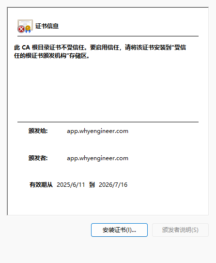

### 3. Generate Client Certificate

```bash
# Generate client private key
openssl genrsa -out client.key 4096

# Generate public keys
openssl rsa -in client.key -pubout > client_pub.key
openssl rsa -in ca.key -pubout > ca_pub.key

# Create certificate signing request
openssl req -new -key client.key -out client.csr -config req.cnf

# Sign the client certificate with CA
openssl x509 -req -in client.csr -CA ca.crt -CAkey ca.key -out client.crt -CAcreateserial
```

## Return Value Codes

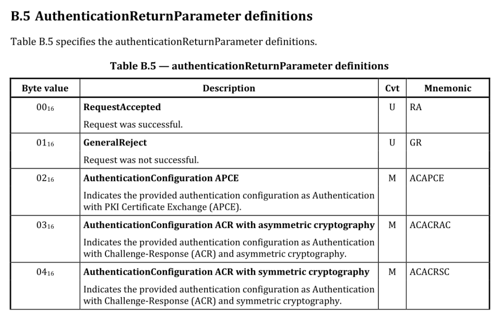

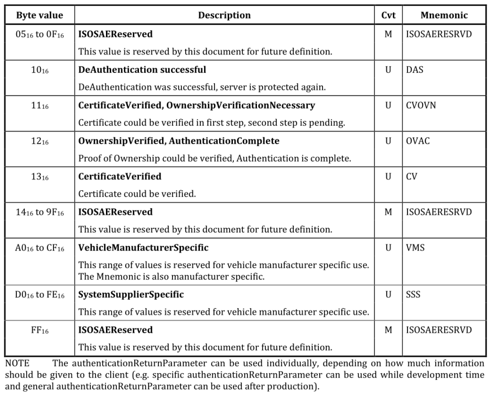

## Key Exchange Algorithm (ECDH/DH)

ECDH (Elliptic Curve Diffie-Hellman) enables two parties to establish a shared secret over an insecure channel. The algorithm works based on the property:
**(a × G) × b = (b × G) × a**

Where:

- `a` and `b` are private keys
- `G` is the generator point
- `×` represents elliptic curve point multiplication

**ECDH Process:*

1. Alice generates: <span v-pre>`{alicePrivKey, alicePubKey = alicePrivKey × G}`</span>
2. Bob generates: <span v-pre>`{bobPrivKey, bobPubKey = bobPrivKey × G}`</span>  
3. They exchange public keys over insecure channel
4. Alice computes: sharedKey = bobPubKey × alicePrivKey
5. Bob computes: sharedKey = alicePubKey × bobPrivKey
6. Both parties now have the same shared secret

## Authentication Sequence

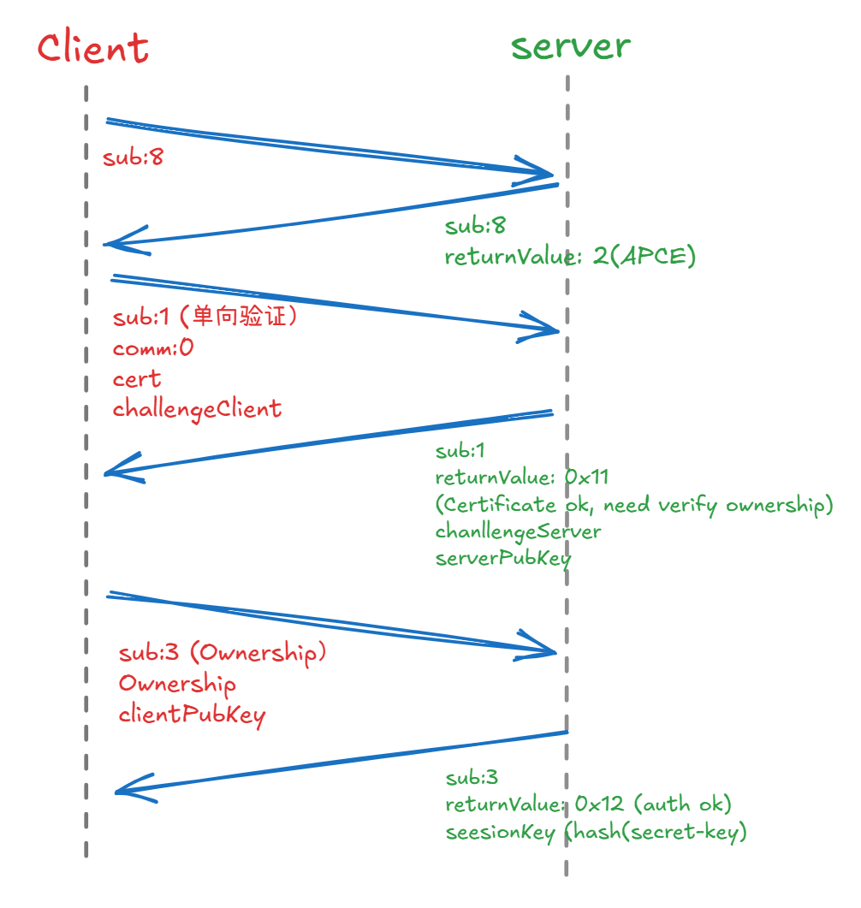

## yingting Implementation

### 1. Configure Authentication Sequence

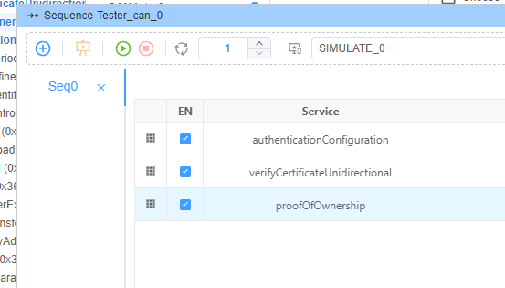

### 2. Configure Tester Script

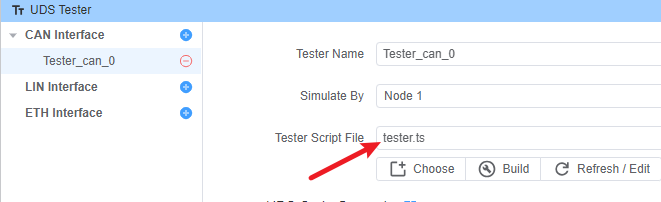

**tester.ts:**

```typescript
import { DiagRequest } from "ECB"
import fs from 'fs/promises'
import path from "path"

const challenge = Buffer.from(Array(32).fill(0).map(() => Math.floor(Math.random() * 256)))

Util.Init(async ()=>{
  // Read client certificate
  const cert = await fs.readFile(path.join(process.env.PROJECT_ROOT,'client.crt'),'utf-8')
  
  // Configure verifyCertificateUnidirectional request
  const verifyCertificateUnidirectional = DiagRequest.from("Tester_can_0.verifyCertificateUnidirectional")
  
  // Set certificate parameters
  verifyCertificateUnidirectional.diagSetParameterSize('certificateClient',cert.length*8)
  verifyCertificateUnidirectional.diagSetParameter('certificateClient',cert)
  verifyCertificateUnidirectional.diagSetParameter('lengthOfCertificateClient',cert.length)
  
  // Set challenge parameters
  verifyCertificateUnidirectional.diagSetParameter('lengthOfChallengeClient',32)
  verifyCertificateUnidirectional.diagSetParameterSize('challengeClient',32*8)
  verifyCertificateUnidirectional.diagSetParameterRaw('challengeClient',challenge)
  
  await verifyCertificateUnidirectional.changeService()
})
```

### 3. Configure ECU Simulator

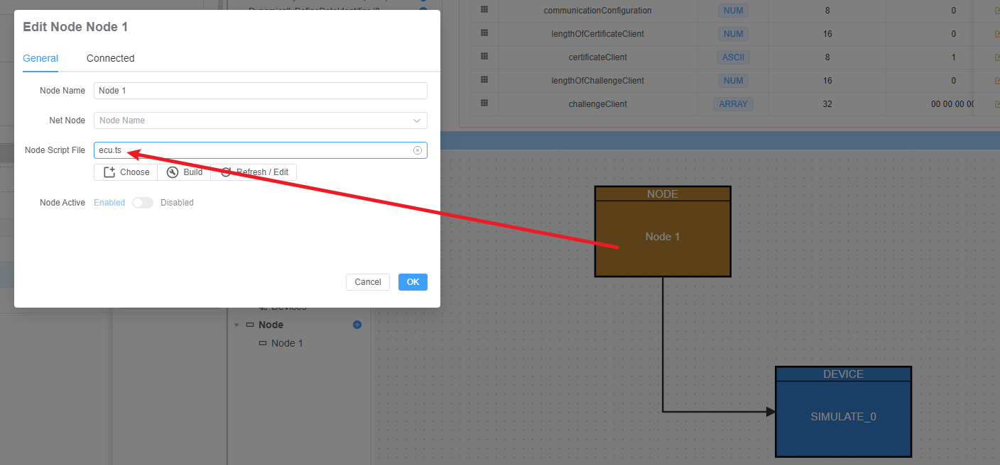

**ecu.ts:**

```typescript
import { DiagResponse } from "ECB"

Util.On("Tester_can_0.authenticationConfiguration.send",async (req)=>{
    const resp=DiagResponse.fromDiagRequest(req)
    resp.diagSetParameterSize('returnValue',0x2) // APCE mode
    await resp.outputDiag()
})
```

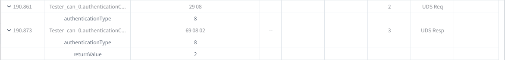

### 4. Certificate Verification Process

```typescript
Util.On("Tester_can_0.verifyCertificateUnidirectional.send",async (req)=>{
    const resp=DiagResponse.fromDiagRequest(req)
    
    const data=req.diagGetRaw()
    const lengthOfCertificateClient=data.readUint16BE(3)
    console.log(`Certificate length: ${lengthOfCertificateClient}`)
    
    // Parse and verify certificate
    const cert=new crypto.X509Certificate(data.subarray(5,5+lengthOfCertificateClient))
    console.log(`Certificate issuer: ${cert.issuer}`)
    
    const ca_str= await fs.readFile(path.join(process.env.PROJECT_ROOT,'ca.crt'),'utf-8')
    const ca=new crypto.X509Certificate(ca_str)
    const verifyResult=cert.verify(ca.publicKey)
    console.log(`Verification result: ${verifyResult}`)
    
    if(verifyResult){
        resp.diagSetParameter('lengthOfChallengeServer',32)
        resp.diagSetParameterSize('challengeServer',32*8)
        resp.diagSetParameterRaw('challengeServer',challenge)
        resp.diagSetParameter('returnValue',0x11) // Certificate OK, verify ownership
        await resp.outputDiag()
    } else {
        throw new Error('Client certificate verification failed')
    }
})
```

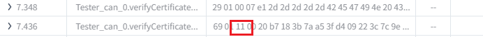

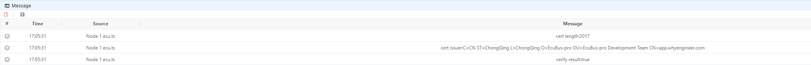

### 5. Digital Signature Process

```typescript
Util.On("Tester_can_0.verifyCertificateUnidirectional.recv",async (resp)=>{
    const data=resp.diagGetRaw()
    const lengthOfChallengeServer=data.readUint16BE(3)
    const challenge=data.subarray(5,5+lengthOfChallengeServer)
    console.log(`Challenge: ${challenge.toString('hex')}`)
    
    // Sign challenge with client private key
    const privateKey=await fs.readFile(path.join(process.env.PROJECT_ROOT,'client.key'),'utf-8')
    const sign=crypto.sign('RSA-SHA256',challenge,privateKey)
    console.log(`Signature: ${sign.toString('hex')}`)
    
    // Configure proof of ownership request
    const proofOfOwnership = DiagRequest.from("Tester_can_0.proofOfOwnership")
    proofOfOwnership.diagSetParameterSize('proofOfOwnershipClient',sign.length*8)
    proofOfOwnership.diagSetParameterRaw('proofOfOwnershipClient',sign)
    proofOfOwnership.diagSetParameter('lengthOfProofOfOwnershipClient',sign.length)
    
    await proofOfOwnership.changeService()
})
```

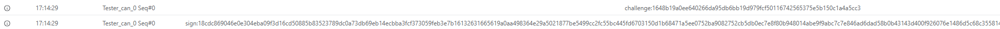

### 6. Ownership Verification

First, extract the public key from the certificate:

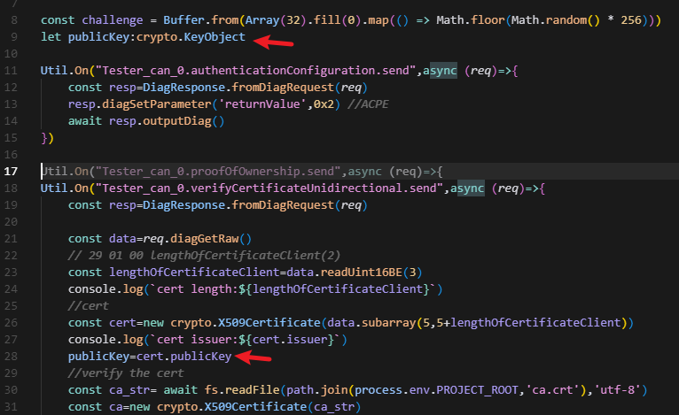

Then verify the signature:

```typescript
Util.On("Tester_can_0.proofOfOwnership.send",async (req)=>{
    const resp=DiagResponse.fromDiagRequest(req)
    const data=req.diagGetRaw()
    
    const lengthOfProofOfOwnershipClient=data.readUint16BE(2)
    const sign=data.subarray(4,4+lengthOfProofOfOwnershipClient)
    
    // Verify signature using certificate's public key
    const verifyResult=crypto.verify('RSA-SHA256',challenge,publicKey,sign)
    console.log(`Verification result: ${verifyResult}`)
    
    if(verifyResult){
        resp.diagSetParameter('returnValue',0x12) // Authentication successful
        await resp.outputDiag()
    } else {
        throw new Error('Client signature verification failed')
    }
})
```

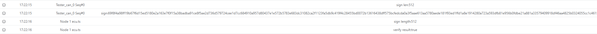
